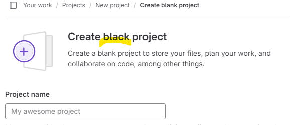
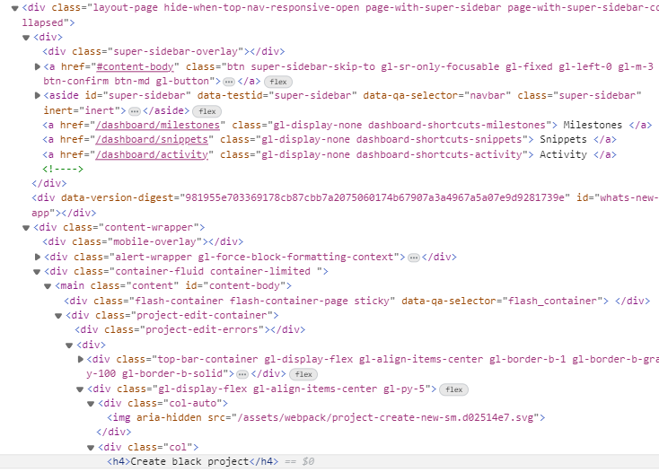

## Summary (Summarize the bug encountered concisely)

Misspelled h4-header on 'Create blank project' page https://gitlab.com/projects/new#blank_project

Header is "Create black project" instead of "Create blank project"

## Steps to reproduce     

Sign in and go to url https://gitlab.com/projects/new#blank_project

Projects / New Project / Create blank project

## What is the current bug behavior?

Misspelled h4-header 'Create black project' on 'Create blank project' page

## What is the expected correct behavior?

h4-Header 'Create blank project' on 'Create blank project' page

     
## Relevant logs and/or screenshots

Misspelling can be found from Projects / New Project / Create blank project

from inside multiple classes without Id or name:

    ...

    

    

 
    

    <h4>Create black project</h4> 

## Possible fixes

Couldn't get the line of the code from Developers Tools / Source Code, so here is
a screenshot of site's HTML, bug can be found on the bottom of the picture:

      

## Whom do you report/ Assign To/ Tags

/label ~bug ~reproduced ~needs-investigation /cc @project-manager /assign @qa-tester

## Priority

Low

      
